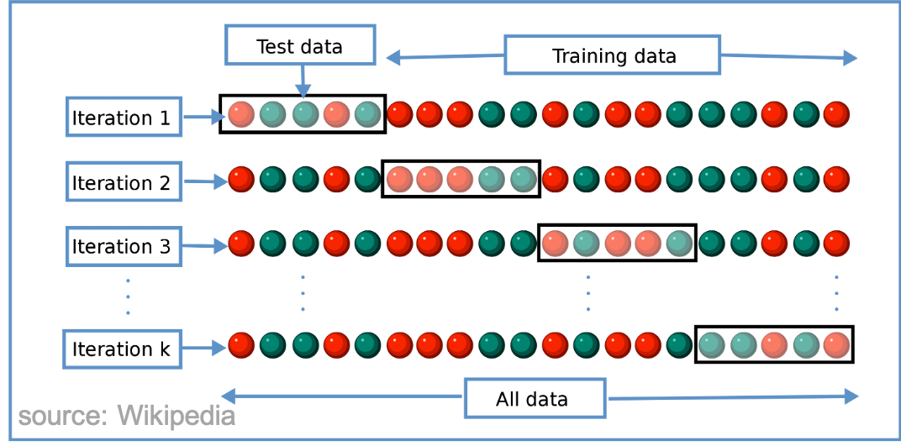
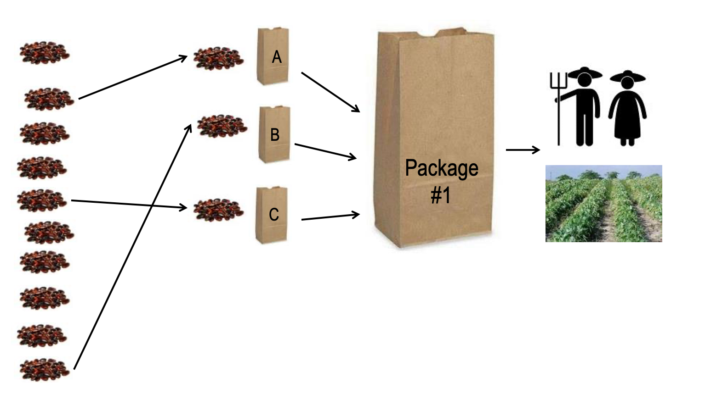

```{r setup, include=FALSE}
options(htmltools.dir.version = FALSE)
```


# Content
--

* Some concepts

--

* Our workflow

--

* A case study with tricot (*triadic comparison of technologies*)

--
* A case study with meta-analysis 

---
# What is machine learning?

.pull-left[
**Machine learning** (ML) is the scientific study of algorithms and statistical models that computer systems use to perform a specific task without using explicit instructions, relying on patterns and inference instead. ML algorithms build a mathematical model based on sample data, known as "training data", in order to make predictions or decisions [1,2].


]
.footnote[
[1] [Wikipedia](https://en.wikipedia.org/wiki/Machine_learning)
[2] [James et al. 2013](https://doi.org/10.1007/978-1-4614-7138-7)
]

--
.pull-right[

]

---
# Recursive partitioning trees (rpart)

**Recursive partitioning** is a ML method for classification. It creates a decision tree that strives to correctly classify members of the population by splitting it into sub-populations where the feature space is recursively split into regions containing observations with similar response values[1]


We use **model-based recursive partitioning** which is a variant of **rpart** with the idea to partition the feature space to identify groups of subjects with similar values of the parameters of a model of interest[2]

<center>

</center>

.footnote[
[1] [Strobl et al. 2009](http://dx.doi.org/10.1037/a0016973)
[2] [Zeileis et al. 2012](https://doi.org/10.1198/106186008X319331)
]
---
# How it works

--
1. Fit a model to the full data.

--

2. Assess the stability of the worth parameters with respect to each covariate. That is, test for a structural change in the dependent variable to the first derivatives of the log-likelihood, when these contributions are ordered by covariate values

--

3. If there is significant instability, split the full data by the covariate with the strongest instability, using the cut-point that gives the highest improvement in model fit

--

4. Repeat steps 1-3 for each subgroup until there are no more significant instabilities, or a split produces a subgroup below a given size threshold[1]

.footnote[
[1] [Turner et al. 2020](https://doi.org/10.1007/s00180-020-00959-3)
]
---
# Forward and cross-validation

**Forward selection** is a type of stepwise regression which begins with an empty model and adds in variables one by one. In each forward step, you add the one variable that gives the single best improvement to your model.

**Cross-validation** is a resampling procedure used to evaluate ML models on a limited data sample. 

<center>

</center>
---

# Citizen science

Scientific research carried out, at least in part, by non-professional scientists

<center>

</center>

---
# Triadic comparison of technologies



.foot-note[
[van Etten (2019a)](https://doi.org/10.1017/S0014479716000739)
]

---
class: middle, inverse
# How we apply these methods

---
# Workflow
.pull-left[

]
--
(**A**) Several participants contribute with small tasks. All data is combined using rankings.

--

(**B**) Explanatory variables are added (e.g. using lonlat and planting dates, or even DNA markers)

--

(**C**) Model selection to find the variables that best explain the data

--

(**D**) Automated reports can be generated and feedback to participants in (**A**) is given

--

(**E**) A stable *rpart* is used for further analysis

---
class: middle
# R packages that we developed to support this workflow:
&nbsp; &nbsp; &nbsp; &nbsp; &nbsp; 

---

class: middle, inverse
# Now to the hands-on part!

---

class: middle
# Common beans in Niragua with the *tricot* method

---

```{r, echo=TRUE, message=FALSE}
library("readr")
library("PlackettLuce")
library("qvcalc")
library("gosset")
library("ggplot2")
library("abind")
library("foreach")
library("doParallel")
```

---


---
# **Thank you!**
.pull-left[


]

.pull-right[

[@desousakaue](https://twitter.com/desousakaue)

[k.desousa@cgiar.org](mailto:k.desousa@cgiar.org)
]

.footnote[

]
